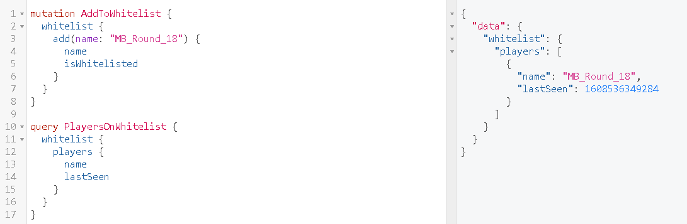

# MC Doubletap

## Compatibility 

> Compatibility is based on where I have tested the plugin and if it worked without issue.  

- Java 11+ (This plugin does not support Java 1.8)
- PaperMC 1.16+
- Bukkit 1.16+

This plugin uses bstats for metrics, check out the bstats page at `https://bstats.org/plugin/bukkit/Doubletap/9717`
## Setup

### Server Owners

- [Download the latest snapshot](https://github.com/mbround18/mc-doubletap/releases/tag/latest-snapshot) or compile a jar and place it into your `plugins` folder.
- Start or Restart the server. 
- Edit the file located at: `./plugins/Doubletap/config.json`

> Currently, the config.json starts with a base authorizer as default. I suggest you change this to your liking. 
> What I have done is use Keycloak for my role authorizer. 
> What you could do is put the graphql interface behind http basic auth and make admin the base. 
> Or perhaps, use netlify or keycloak. 

## Query Examples

### Whitelist

### Developers

- Git clone the repo.
- Open the project up in Idea or another IDE. 
- Run `docker-compose up`

## Information

### Inspiration 

I was inspired by the following plugins: 

- [Server Tap](https://servertap.io/) 
  
    This project inspired me to explore other options, I landed on graphql and its implementation because these beans are awesome! 
  
- [BlueMap](https://github.com/BlueMap-Minecraft/BlueMap)

    These guys are freaking awesome! Blue the owner has been super helpful in discussion, and the plugin BlueMap is a superb plugin. 
    I just wanted to see if I could take the API concept a step further.
  

### Things I like

- Graphql-java integrates super well with the API provided by Bukkit. It automatically calls `getName` and other functions based on whats available in the schema.
- Using Java-Spark is light weight and does not require me to re-invent the wheel for a web server to run behind the scenes. 

### Things I don't like

- The plugin has instance issues, replacing the jar file and then reloading the server breaks the interface. I wish I could make it more resilient, but I am unsure how. 

### Plans for the future

- Completed: Currently, I will enable harmless endpoints for information and limit what is publicly available. 
- Completed: I intend to implement policy based authorization, which in turn will allow operators to design auth schemas for people who are signed in. 
- Completed: Authentication will be enforced via JWT or similar authorization structure. With the end goal of making authorization simple to implement on a frontend or server to server application. 

