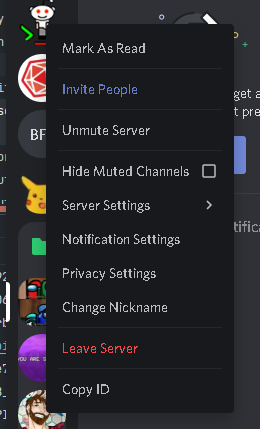

# MC Doubletap

## Compatibility 

> Compatibility is based on where I have tested the plugin and if it worked without issue.  

- Java 11+ (This plugin does not support Java 1.8)
- PaperMC 1.16+
- Bukkit 1.16+

This plugin uses bstats for metrics, check out the bstats page at `https://bstats.org/plugin/bukkit/Doubletap/9717`
## Setup

### Server Owners

- [Download the latest snapshot](https://github.com/mbround18/mc-doubletap/releases/tag/latest-snapshot) or compile a jar and place it into your `plugins` folder.
- Start or Restart the server. 
- Edit the file located at: `./plugins/Doubletap/config.json`

> Currently, the config.json starts with a base authorizer as default. I suggest you change this to discord.

#### Discord Authorizer Setup

> Using discord as an authorizer means, 
> any role you have in discord is attributed to roles that exist in the `/your/server/path/plugins/Doubletap/policies` folder.
> This means that, if you have a policy called `admin.json` in that folder. It expects users to have an `admin` role assigned to them.
> 
> Note: Any special characters or spaces will be replaced with a `-` which means `MC Game Master` would map to `mc-game-master.json` 

1. Navigate to `https://discord.com/developers/applications`
2. Create an application. 
3. Copy the Client ID and Client Secret for use with the panel. 
4. Click the Bot section.
5. Create a bot.
6. Copy the Bot token to a notepad for now
7. Open discord
8. Click on copy ID
   
   
  > We have you copy your server ID for security reasons. This ensures that your bot simply cannot be added to any given server and have roles faked. 
9. Modify your `config.json` in `/your/server/path/plugins/Doubletap/config.json`: 
  ```json
  {
    "port": 8101,
    "authorizer": "discord",
    "authorizerOptions": {
      "DISCORD_SERVER_ID": "Your Server Id",
      "DISCORD_BOT_TOKEN": "Your Bot Token"
    }
  }
  ```
  > The variables `DISCORD_SERVER_ID` & `DISCORD_BOT_TOKEN` can also be provided as environment variables. They do not need to be hard coded into a config file. 
10. Restart your server with the new config.
11. Invite your bot to your server! 
    > Navigate to `http://your-server-ip:8101/discord/bot`

## Query Examples

### Whitelist


### Developers

- Git clone the repo.
- Open the project up in Idea or another IDE. 
- Run `docker-compose up`

## Information

### Inspiration 

I was inspired by the following plugins: 

- [BlueMap](https://github.com/BlueMap-Minecraft/BlueMap)

  These guys are freaking awesome! Blue the owner has been super helpful in discussion, and the plugin BlueMap is a superb plugin.
  I just wanted to see if I could take the API concept a step further.

- [Server Tap](https://servertap.io/) 
  
    This project inspired me to explore other options, I landed on graphql and its implementation because these beans are awesome!

### Things I like

- Graphql-java integrates super well with the API provided by Bukkit. It automatically calls `getName` and other functions based on whats available in the schema.
- Using Java-Spark is light weight and does not require me to re-invent the wheel for a web server to run behind the scenes. 


### Things I don't like

- The plugin has instance issues, replacing the jar file and then reloading the server breaks the interface. I wish I could make it more resilient, but I am unsure how. 


### Plans for the future

- Add a feature to allow subscriptions to data. This will provide a useful interface for things like player positions etc.
- Add ban feature
- Add plugin feature
- Add command feature

### Completed Plans

- Enable harmless endpoints for information and limit what is publicly available.
- Implement policy based authorization, which in turn will allow operators to design auth schemas for people who are signed in.
- Enforce authentication via JWT or similar authorization structure. With the end goal of making authorization simple to implement on a frontend or server to server application.

